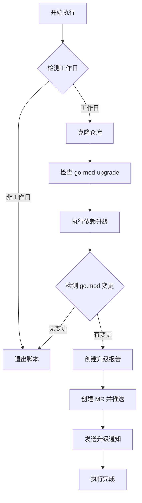

# dependabot-go-gitlab

一个类似 Dependabot 的 Go 模块依赖自动升级工具，专为私有化部署的 GitLab CI 设计，支持依赖检测、版本升级和合并请求自动化创建。

## 🤖 为什么使用 dependabot-go-gitlab？

Dependabot 是流行的依赖自动化管理工具，但不支持 http 部署的私有化 GitLab 以及无法突破 GFW 封锁。`dependabot-go-gitlab` 填补了这一空白，提供：

- **Go 模块专属支持**：基于 `go mod` 和 `go-mod-upgrade` 深度集成
- **GitLab CI 原生适配**：自动创建 MR 并生成详细升级报告
- **智能升级策略**：仅在直接依赖变更时创建 MR，减少噪音
- **工作日过滤**：避免周末执行任务，符合工程团队工作节奏

## 🚀 快速开始

### 1. 在 GitLab CI 中配置

在项目的 `.gitlab-ci/ci` 目录添加：`go-mod-upgrade.gitlab-ci.yml` 文件
指定runner的tags，若需要的话：

```yaml
tags:
    - your_tags
```

### 2. 配置 Pipeline Schedules 环境变量

在 GitLab 项目 **Settings > CI/CD > Schedules** 中：
1. **创建新的定时任务**：
   - **Description**：自定义名称（如 `每周依赖升级`）
   - **Interval pattern**：设置执行频率（如 `0 10 * * 1-5` 表示工作日 10:00）
   - **Target branch**：选择 `master` 或你的主分支

2. **添加环境变量**：
   | 变量名            | 描述                     | 示例值                          |
   |-------------------|--------------------------|---------------------------------|
   | `AUTO_UPGRADE`    | 启用自动升级             | `true`                          |
   | `PRIVATE_TOKEN`   | 项目访问令牌（需 `api` 和 `write_repository` 权限） | `glpat-xxx`                     |
   | `IGNORED_MODULES` | 忽略的模块（逗号分隔）   | `github.com/casbin/casbin/v2`   |
   | `MR_TITLE_PREFIX` | MR 标题前缀              | `[dependabot]`                  |
   | `NOTIFICATION_URL`| 通知 API 地址            | `http://通知服务地址`           |
   | `DINGTALK_WEBHOOK`| 钉钉通知 API 地址         | `https://oapi.dingtalk.com/robot/send?access_token=xxx` |

### 🔐 **GitLab 访问令牌配置**
1. **生成个人访问令牌**：
   - 访问 **User Settings > Access Tokens**
   - 填写名称（如 `dependabot-token`）
   - 勾选权限：
     - `api`（必须，用于创建 MR）
     - `write_repository`（必须，用于推送新分支）
   - 点击 **Create personal access token**，**立即复制**生成的令牌

2. **添加到项目变量**：
   - 进入 **Settings > CI/CD > Variables**
   - 添加变量 `PRIVATE_TOKEN`，值为生成的令牌（勾选 **Mask variable** 隐藏敏感信息）


## 🧰 功能特性

### 依赖管理
- ✅ 基于 `go list` 和 `go mod tidy` 精准检测依赖变更
- ✅ 支持忽略特定模块（如 casbin、huaweicloud-sdk）
- ✅ 生成 `current_deps.txt` 和 `upgraded_deps.txt` 对比文件

### CI/CD 集成
- ✅ 自动创建以 `dependabot-go-mod-` 为前缀的分支
- ✅ 通过 GitLab API 生成带 release notes 的 MR
- ✅ 升级完成后发送通知到指定 API

### 智能控制
- ✅ 工作日检测（通过 timor.tech API）
- ✅ 仅在直接依赖变更时创建 MR
- ✅ 自动跳过无变更的升级周期


## 📈 执行流程




## 🛠️ 自定义扩展

### 1. 替换工作日检测服务
```bash
# 原 API（中国节假日）
workday=$(curl -s "http://timor.tech/api/holiday/info/${current_date}" | jq -r '.type.type')

# 替换为其他服务（如谷歌日历 API）
workday=$(curl -s "https://calendar.googleapis.com/.../holidays" | jq -r '.status')
```

### 2. 新增通知渠道（钉钉示例）
```bash
if [ -n "$DINGTALK_WEBHOOK" ]; then  
  curl -X POST "$DINGTALK_WEBHOOK" \
    -H "Content-Type: application/json" \
    -d '{"msgtype":"text","text":{"content":"🚀 依赖升级完成，MR: '$MR_URL'"}}'  
fi
```


## 🚧 **常见问题解答**

### ❓ **执行失败提示 `403 Forbidden`**
- **原因**：`PRIVATE_TOKEN` 权限不足或已过期
- **解决**：
  1. 检查令牌是否包含 `api` 和 `write_repository` 权限
  2. 重新生成令牌并更新项目变量

### ❓ **MR 未自动创建**
- **原因**：
  - `AUTO_UPGRADE` 未设置为 `true`
  - 依赖无变更
  - API 地址配置错误（如私有部署的 `CI_API_V4_URL`）
- **解决**：
  1. 确认环境变量配置正确
  2. 手动触发 Pipeline 查看日志

### ❓ **如何测试配置是否正确？**
- 临时将 `AUTO_UPGRADE` 设置为 `true`
- 手动触发 Pipeline 执行（无需等待定时任务）


## 📄 许可证
MIT License © 2025 dependabot-go-gitlab contributors

### 项目路线图（Roadmap）

#### 🚀 近期目标（1.0版本 - 核心功能完善）
- [ ] **多AI厂商支持**  
  实现可插拔的AI服务接口，支持OpenAI、Deepseek、豆包等主流AI模型，通过配置文件动态切换，  
  ✅ 已完成基础框架设计，支持通过环境变量指定AI供应商及API密钥  

- [ ] **脚本模块化重构**  
  将主脚本拆分为独立功能模块（依赖检测、升级执行、MR生成、AI分析），提升可维护性  
  ✅ 已完成公共函数与核心逻辑分离，支持通过`source`引入子脚本  

- [ ] **智能风险评估体系**  
  基于AI分析生成升级风险等级（低/中/高），并提供兼容性建议  
  ✅ 已实现OpenAI接口对接，支持release notes摘要生成  

#### 🧩 中期目标（2.0版本 - 部署与生态扩展）
- [ ] **Docker容器化支持**  
  提供官方Docker镜像，支持通过GitLab CI直接运行容器化任务  
  📋 规划：包含基础镜像与 slim镜像两种版本，支持ARM/AMD架构  

- [ ] **Helm图表发布**  
  提供Kubernetes部署方案，支持通过Helm一键部署到集群环境  
  📋 规划：支持多环境配置（开发/测试/生产），集成Secret管理  

- [ ] **私有部署优化**  
  增强对私有GitLab实例、私有Go模块仓库的支持，完善认证机制  
  📋 规划：支持SSH密钥、HTTP Basic Auth等多种认证方式  

#### 🌍 长期目标（3.0版本 - 生态与社区建设）
- [ ] **插件系统开发**  
  提供插件接口，支持用户自定义升级策略、通知渠道、AI分析逻辑  
  📋 规划：支持Go插件与Shell脚本两种扩展方式  

- [ ] **Web管理界面**  
  开发轻量化Web界面，支持查看升级历史、风险报告、配置管理  
  📋 规划：前后端分离架构，支持Docker Compose快速部署  

- [ ] **多语言支持**  
  扩展支持Java（Maven/Gradle）、Python（pip）、Node.js（npm）等语言依赖升级  
  📋 规划：优先支持Java生态，复用Go模块升级核心逻辑  


### 🤝 社区共建指南
1. **功能投票**  
   欢迎在[Issue区](https://github.com/me-cs/dependabot-go-gitlab/issues)对以上路线图功能投票，或提交新需求  
   ⚠️ 格式示例：`+1 支持Helm部署` 或 `建议增加对华为云API的支持`

2. **贡献代码**  
   - Fork项目并创建Feature分支（命名规范：`feature/{功能名称}`）  
   - 提交PR时需附带测试用例和文档说明  
   - 核心模块变更需先通过Issue讨论方案  

3. **提供部署方案**  
   若您需要特定部署方式（如Ansible、Terraform、Kustomize等），可：  
   1. 在Issue中提交`部署方案请求`，说明具体场景  
   2. 直接提交包含该部署方案的PR  


### 📌 当前优先事项
- [ ] **完善多AI厂商文档**  
  补充不同AI供应商的配置示例（如Claude、文心一言的API调用参数）  
- [ ] **优化CI脚本性能**  
  实现依赖升级任务的并行处理，减少大规模项目的执行时间  
- [ ] **增加单元测试**  
  为核心功能（依赖检测、MR生成）添加Shell单元测试，提升代码稳定性  


## 👥 社区与支持
- 🐛 [提交 Issue](https://github.com/your-username/dependabot-go-gitlab/issues)
- 🌟 欢迎 Star 和 Fork，共同完善 Go 依赖自动化管理！
