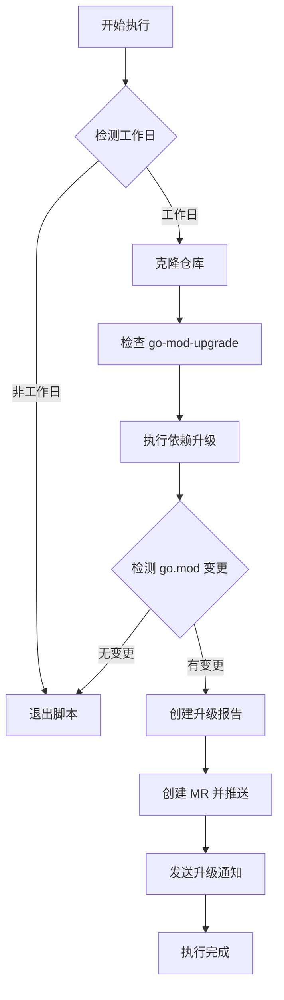

# dependabot-go-gitlab

一个类似 Dependabot 的 Go 模块依赖自动升级工具，专为私有化部署的 GitLab CI 设计，支持依赖检测、版本升级和合并请求自动化创建。

## 🤖 为什么使用 dependabot-go-gitlab？

Dependabot 是流行的依赖自动化管理工具，但不支持 http 部署的私有化 GitLab 以及无法突破 GFW 封锁。`dependabot-go-mod` 填补了这一空白，提供：

- **Go 模块专属支持**：基于 `go mod` 和 `go-mod-upgrade` 深度集成
- **GitLab CI 原生适配**：自动创建 MR 并生成详细升级报告
- **智能升级策略**：仅在直接依赖变更时创建 MR，减少噪音
- **工作日过滤**：避免周末执行任务，符合工程团队工作节奏

## 🚀 快速开始

### 1. 安装依赖

```bash
# 确保系统工具可用（选择对应系统）
sudo apt-get install curl jq  # Debian/Ubuntu
sudo yum install curl jq      # CentOS/RHEL
```

### 2. 在 GitLab CI 中配置

在项目的 `.gitlab-ci/ci` 目录添加：go-mod-upgrade.gitlab-ci.yml 文件

### 3. 配置环境变量

在 GitLab 项目设置中添加以下环境变量：
| 变量名            | 描述                     | 示例值                          |
|-------------------|--------------------------|---------------------------------|
| `AUTO_UPGRADE`    | 启用自动升级              | `true`                          |
| `PRIVATE_TOKEN`   | 项目访问令牌              | `glpat-xxx`                     |
| `IGNORED_MODULES` | 忽略的模块（逗号分隔）    | `github.com/casbin/casbin/v2`   |
| `MR_TITLE_PREFIX` | MR 标题前缀               | `[dependabot]`                 |
| `NOTIFICATION_URL`| 通知 API 地址             | `http://通知服务地址`           |
| `DINGTALK_WEBHOOK`| 钉钉通知 API 地址         | `http://通知服务地址`           |

## 🧰 功能特性

### 依赖管理
- ✅ 基于 `go list` 和 `go mod tidy` 精准检测依赖变更
- ✅ 支持忽略特定模块（如 casbin、huaweicloud-sdk）
- ✅ 生成 `current_deps.txt` 和 `upgraded_deps.txt` 对比文件

### CI/CD 集成
- ✅ 自动创建以 `dependabot-go-mod-` 为前缀的分支
- ✅ 通过 GitLab API 生成带 release notes 的 MR
- ✅ 升级完成后发送通知到指定 API

### 智能控制
- ✅ 工作日检测（通过 timor.tech API）
- ✅ 仅在直接依赖变更时创建 MR
- ✅ 自动跳过无变更的升级周期

## 📈 执行流程



## 🛠️ 自定义扩展

### 1. 替换工作日检测服务
```bash
# 原 API（中国节假日）
workday=$(curl -s "http://timor.tech/api/holiday/info/${current_date}" | jq -r '.type.type')

# 替换为其他服务（如谷歌日历 API）
workday=$(curl -s "https://calendar.googleapis.com/.../holidays" | jq -r '.status')
```

### 2. 新增通知渠道（钉钉示例）
```bash
if [ -n "$DINGTALK_WEBHOOK" ]; then  
  curl -X POST "$DINGTALK_WEBHOOK" \
    -H "Content-Type: application/json" \
    -d '{"msgtype":"text","text":{"content":"🚀 依赖升级完成，MR: '$MR_URL'"}}'  
fi
```

## 📄 许可证
MIT License © 2025 dependabot-go-mod contributors

## 👥 社区与支持
- 🐛 [提交 Issue](https://github.com/your-username/dependabot-go-mod/issues)
- 🌟 欢迎 Star 和 Fork，共同完善 Go 依赖自动化管理！
